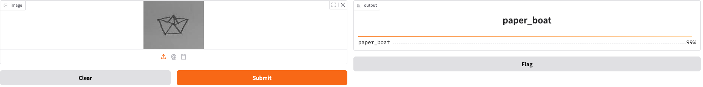
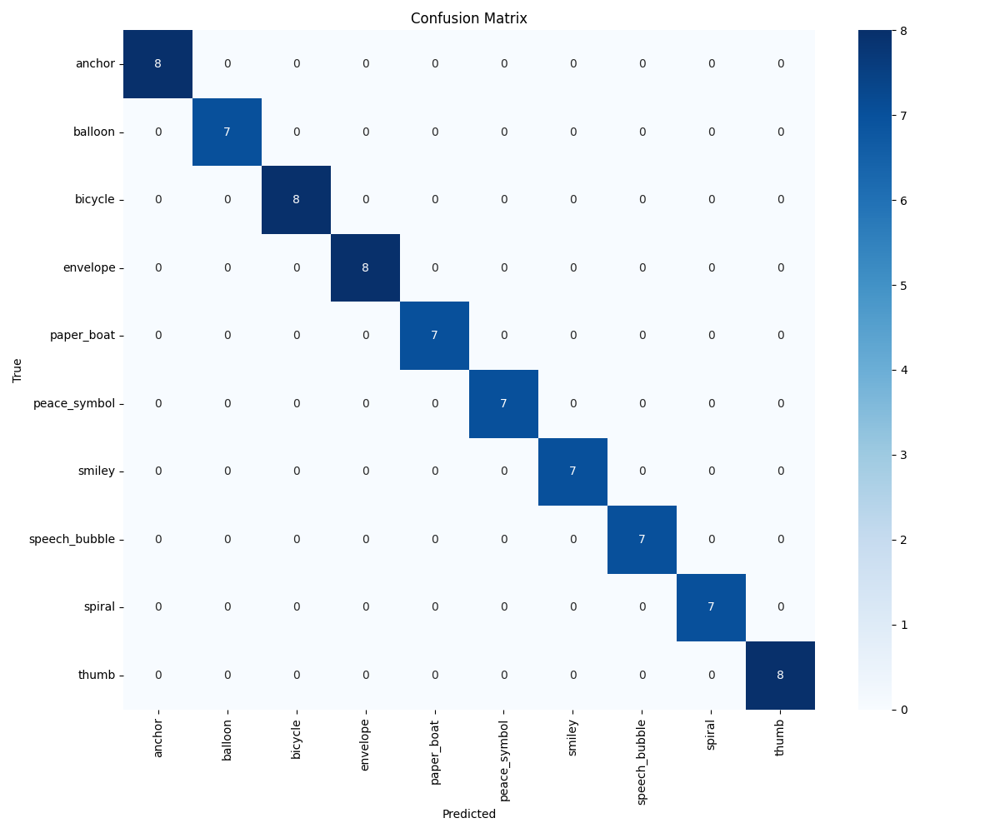

# Hand-drawn Image Classifier



A simple image classifier for hand-drawn symbols. Uses ResNet50 with transfer learning to classify 10 different categories.

Dataset used: [Simple hand-drawn and digitized images](https://www.kaggle.com/datasets/gergvincze/simple-hand-drawn-and-digitized-images/data)

## Requirements

- **Python 3.11+**
- **uv package manager** - https://docs.astral.sh/uv/getting-started/installation/

## Quick Start

1. **Clone and setup:**

   ```bash
   git clone https://github.com/00200200/image-classifier.git
   cd image-classifier

   # Install dependencies
   uv sync
   ```

2. **Split Dataset** 
    ```bash
    uv run python -m src.preprocess.preprocess
    ```

3. **Train model:**
   ```bash
   uv run python -m src.scripts.train
   ```

4. **Check the results:**

    ```bash
    uv run python -m src.scripts.evaluate
    ```

 5. **Run the Gradio demo:**

    ```bash
    uv run python -m src.app.app
    ```

## Results



## Structure

```
image-classifier/
├── src/
│   ├── model/       # ResNet50 
│   ├── data/        # DataModule for loading images
│   ├── preprocess/  # Script to split dataset
│   ├── scripts/     # train.py and evaluate.py
│   └── app/         # Gradio web interface
├── data/
│   ├── raw/         # Dataset
│   └── processed/   # Generate train/val/test splits
├── notebooks/       # EDA notebook
└── lightning_logs/  # Training checkpoints
```


## Tech stack

- PyTorch + Lightning for training
- ResNet50 pretrained on ImageNet
- Gradio for the demo interface
- uv for package management
